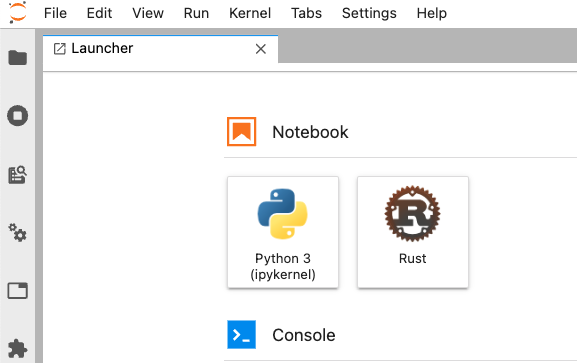

# Rust tutorial
This is a rust totorial page for programming language subject, Universidad nacional de Colombia.

## Como replicar el Notebook
### Instalar Miniconda
Puedes seguir las instrucciones desde su [pagina oficial](https://docs.conda.io/projects/miniconda/en/latest/) y descargar la version de tu sistema operativo.

Para MacOs podemos hacer lo siguiente:
```bash
curl https://repo.anaconda.com/miniconda/Miniconda3-latest-MacOSX-arm64.sh
chmod +x Miniconda3-latest-MacOSX-arm64.sh
./Miniconda3-latest-MacOSX-arm64.sh 
```
### Crear tu ambiente de Conda
Despues de verificar que tienes Miniconda en tu PATH, puedes crear un ambiente en el que se encapsularan todos los paqueten que vas a necesitar con el siguiente comando.
```bash
conda create -n tutorial python=3
```

Seguidamente tienes que activar tu amibente con el nombre que lo creaste.
```bash
conda activate tutorial
```

### Instalar paquetes
Vamos a necesitar los sigientes paquetes
```bash
conda install -c conda-forge jupyterlab=2.2.9
conda install -c anaconda cmake -y
conda install -c conda-forge nodejs=15 -y
```
### Instalar Rust
Puedes instalar Rust por medio de Rustup, puedes ver otros metodos de instalacion en su [pagina oficial](https://forge.rust-lang.org/infra/other-installation-methods.html).
```bash
curl --proto '=https' --tlsv1.2 -sSf https://sh.rustup.rs | sh
```
Debes asegurarte de añadir cargo a tu PATH.

### Instalar el EvCxR kernel de Jupyter
Puedes visitar su [repositorio](https://github.com/evcxr/evcxr/blob/main/evcxr_jupyter/README.md) para tener mas detalles pero basicamente necesitaras esto dos comandos:
```bash
cargo install --locked evcxr_jupyter
evcxr_jupyter --install
```
Si todo se ejecuto correctamente deberias poder hacer una prueba ejecutando jupyter
```bash
jupyter lab
```
Y deberias ver algo como esto


Si quires tener mas detalles, puedes seguir [esta guia](https://datacrayon.com/data-analysis-with-rust-notebooks/setup-anaconda-jupyter-and-rust/).

## Autores
- Elian Gonzalez Ordóñez ([@dgonzalezo](https://github.com/dgonzalezo))
- Camilo Arturo Echeverry Ayala ([@CamiloAyala](https://github.com/CamiloAyala))
- Juan Camilo Garcia Martinez ([@xabelian](https://github.com/xabelian))
- Daniel Alejandro Melo Nuvan ([@]())
